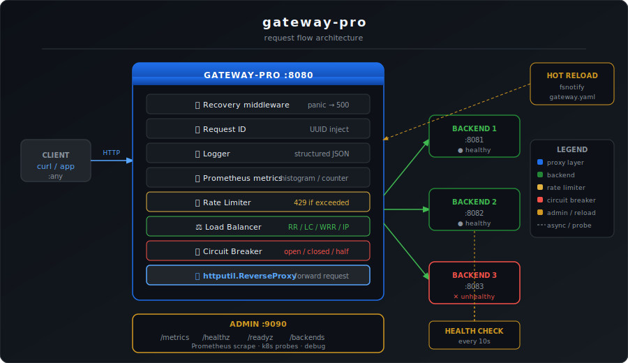

<div align="center">



  <h1>gateway-pro</h1>
  <p><strong>Lightweight, production-grade API gateway written in Go</strong></p>

  [](https://github.com/sneha4175/gateway-pro/actions/workflows/ci.yml)
  [](https://goreportcard.com/report/github.com/sneha4175/gateway-pro)
  [](LICENSE)
  [](go.mod)
  [](https://github.com/sneha4175/gateway-pro/stargazers)
</div>

---

gateway-pro is a single-binary API gateway written in Go. It sits in front of your backend services and handles load balancing, rate limiting, circuit breaking, health checking, and metrics — with zero external dependencies on the hot path.

Built by [@sneha4175](https://github.com/sneha4175).

## Features

- **Load balancing** — round-robin, least-connections, weighted (smooth, nginx-style), IP-hash sticky sessions
- **Rate limiting** — token bucket or sliding window; keyed by IP, user ID, or API key; in-process or distributed via Redis
- **Circuit breaking** — per-backend three-state machine (closed/open/half-open), configurable thresholds
- **Active health checks** — probes every backend every 10s, auto-removes unhealthy nodes
- **Observability** — Prometheus metrics, structured JSON access logs, request ID propagation
- **Hot-reload** — edit gateway.yaml and changes apply instantly, no restart needed
- **Graceful shutdown** — drains in-flight requests on SIGTERM
- **Single binary** — no runtime dependencies, ~10MB Docker image

## Quick start

### Docker
```bash
docker run -p 8080:8080 -p 9090:9090 snehak201/gateway-pro:latest
```

### From source
```bash
git clone https://github.com/sneha4175/gateway-pro.git
cd gateway-pro
make build
./bin/gateway-pro -config configs/gateway.yaml
```

Requires Go 1.22+. No C dependencies.

### Docker Compose (includes Prometheus + Grafana)
```bash
cd examples/docker-compose
docker compose up
```

- Gateway: http://localhost:8080
- Grafana: http://localhost:3000
- Prometheus: http://localhost:9091

## Configuration
```yaml
server:
  addr: ":8080"

admin:
  addr: ":9090"

routes:
  - path_prefix: /api/users
    lb_algorithm: round_robin      # round_robin | least_conn | weighted | ip_hash
    timeout_seconds: 10
    backends:
      - url: http://user-svc-1:8080
      - url: http://user-svc-2:8080

    rate_limit:
      algorithm: sliding_window    # token_bucket | sliding_window
      rate: 500
      window: 1m
      key_by: ip                   # ip | user | api_key

    circuit_breaker:
      failure_threshold: 50
      open_duration_seconds: 30
```

See [configs/gateway.yaml](configs/gateway.yaml) for full annotated example.

## Admin endpoints

| Endpoint | Description |
|----------|-------------|
| GET :9090/metrics | Prometheus metrics |
| GET :9090/healthz | Liveness check |
| GET :9090/readyz | Readiness check |
| GET :9090/backends | Live backend + circuit breaker status |

## Kubernetes
```bash
kubectl apply -f deploy/kubernetes/deployment.yaml
```

Includes HPA (2-10 replicas), liveness/readiness probes, pre-stop drain, and Prometheus scrape annotations.

## Project structure
```
cmd/gateway/          Entry point
internal/
  config/             YAML loader + fsnotify hot-reload
  loadbalancer/       Round-robin, least-conn, weighted, IP-hash
  ratelimiter/        Token bucket + sliding window (local and Redis)
  circuitbreaker/     Three-state circuit breaker
  health/             Active HTTP health checks
  middleware/         Recovery, request ID, logger, Prometheus
  proxy/              Gateway wiring, routes, admin handlers
deploy/
  docker/             Dockerfile (multi-stage, scratch final image)
  kubernetes/         Deployment, Service, ConfigMap, HPA
examples/
  docker-compose/     Full stack with Redis, Prometheus, Grafana
configs/              Annotated example config
```

## Development
```bash
make test          # unit tests with race detector
make lint          # golangci-lint
make bench         # benchmarks
```

## Why not Kong / Traefik / Envoy?

Those are excellent production tools. gateway-pro exists for teams that want a gateway they can read end-to-end, own the config model for, and modify without complexity. The entire codebase is ~1,500 lines of Go with no code generation.

## Contributing

See [CONTRIBUTING.md](.github/CONTRIBUTING.md).

Good first issues: https://github.com/sneha4175/gateway-pro/labels/good-first-issue

## License

Apache 2.0 — see [LICENSE](LICENSE).

---

<div align="center">
  <sub>Built by <a href="https://github.com/sneha4175">sneha4175</a> · <a href="mailto:khorejasneha17@gmail.com">khorejasneha17@gmail.com</a></sub>
</div>
